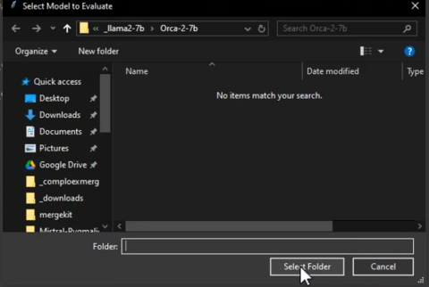
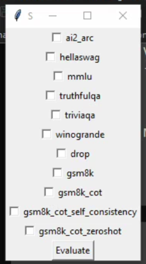
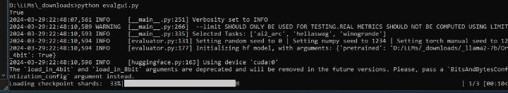
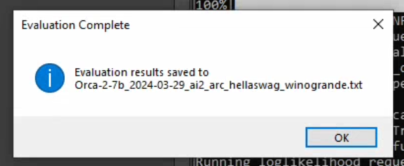
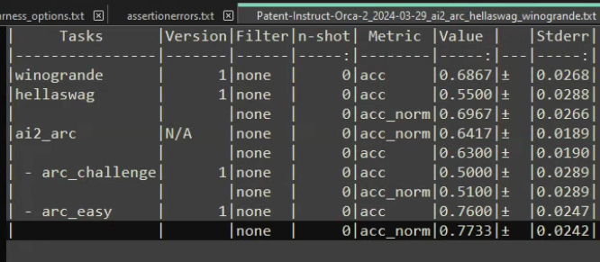

# Model-Tools

This repository is an assorted toolkit of python scripts and systems designed for model diagnostics, test & validation, as well as overall convenience tools that focus on streamlining common operations.

---

## Table of Contents:
- [EasyPEFTGUIPro](#easypeftguipro)
- [Model Evaluation GUI](#model-evaluation-gui)
- [More Tools...](#more-tools)

---

### EasyPEFTGUIPro

`EasyPeftGUIPro` [aka easypeftguipro.py] is designed to simplify the process of fusing a language model with a compatible LoRA, then saving the resulting model to a user's directory of choice.

#### Prerequisites

- Python 3.6 or newer
- `transformers` library
- `torch` library
- `tkinter` library

#### Usage

1. Clone this repository
2. Navigate to the repository folder
3. Run the `easypeftguipro.py` script
4. Follow the on-screen prompts to select the base model, the desired LoRA, and an output directory to save the result.

#### Considerations

This script relies on the `tkinter` library for interactive menus. An OS with a GUI interface is required.
LoRAs made for a different model architecture or B number of parameters than the base language model selected will not successfully merge.
LoRAs can however be merged with any pretrained model based on the same architecture and B of parameter size.

---

### Model Evaluation GUI

<p align="center">
To use Evaluation GUI, aka evalgui.py, simply run the script in a Python environment [if Windows]<BR>
or [if Linux] from the OS interface GUI through a CLI window and follow the steps below:
</p>

<table align="center">
  <tr>
    <td align="center"></td>
    <td align="center"></td>
  </tr>
  <tr>
    <td align="center">1. Run Script, Select Model Folder</td>
    <td align="center">2. Select Eval Sets</td>
  </tr>
  <tr>
    <td align="center"></td>
    <td align="center"></td>
  </tr>
  <tr>
    <td align="center">3. Evaluation Process Continues in CLI</td>
    <td align="center">4. Notification Eval Results Saved</td>
  </tr>
  <tr>
    <td colspan="2" align="center"></td>
  </tr>
  <tr>
    <td colspan="2" align="center">5. When a Model's evals are finished, a file is saved under the name 'model name, date, and evals run.txt.'</td>
  </tr>
</table>

<p align="center">
</p>

#### Prerequisites:
EvalGUI requires EleutherAI's lm-evaluation-harness to be properly installed in the same python environment.
[EleutherAI lm-evaluation-harness](https://github.com/EleutherAI/lm-evaluation-harness)
can be installed simply by following this step:
```
git clone https://github.com/EleutherAI/lm-evaluation-harness
cd lm-evaluation-harness
pip install -e .
```
#### Caveats to Consider and Way Forward
These variables are set for the duration of the script's execution to allow evaluations that require custom code to run unhindered.
Explicitly telegraphing this for users who have security concerns (these lines can simply be deleted from the script and most evals will run fine).
```
os.environ['CUDA_LAUNCH_BLOCKING'] = "True"
os.environ['HF_DATASETS_ALLOW_CODE_EXECUTION'] = "True"
os.environ['ALLOW_REMOTE_CODE'] = "True"
```
This is an Alpha version of the Model Evaluation GUI. Several Quality of Life convenience features are planned and being implemented for the next release(s).
For now, a few key settings are hardcoded into the script for simplicity. ***It may be valuable to reduce batch size from 24 to the recommended 8-16***. The higher the
batch size the faster the process of evaluation however, too high a number may cause Cuda to run into out of memory errors. Also, ***the 'limit' argument should be
removed entirely if one is ready to do entire evaluation sets against their model of choice***. 300 was selected so evalgui.py provides a fairly light and fast sampling
for the sake of determing roughly where a model stands in performance, this is for the sake of rapid iteration [especially when testing performance on different model
merges and merge techniques]. The next release will bring these options out from under the hood and into the GUI (for now, simply edit the python script to suit your needs).

```
    command = [
        "lm_eval",
        "--model", "hf",
        "--tasks", ",".join(selected_tasks),
        "--batch_size", "24",
        "--limit", "300",
        "--device", "cuda:0",
        "--model_args", f"pretrained={model_folder},load_in_4bit=True"
    ]
```


---

## More Tools Coming Soon...
<!-- Future sections for additional tools will go here -->
